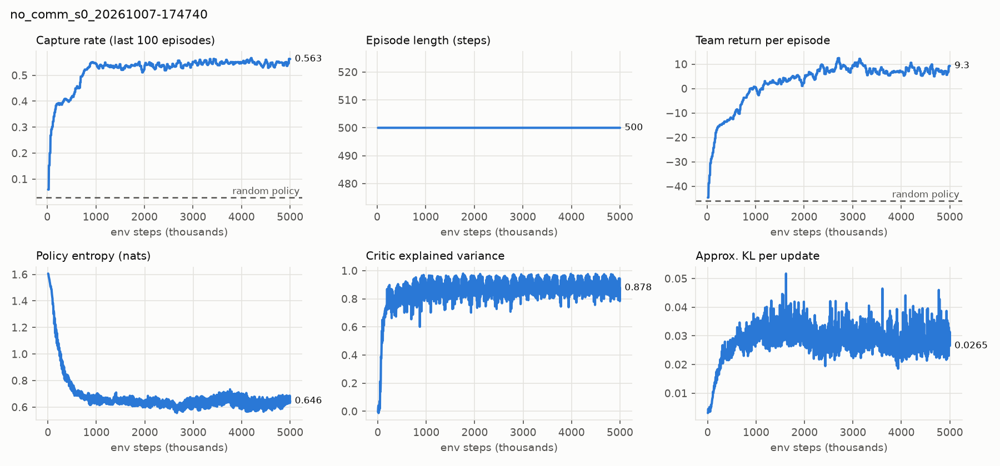

# M2 result: No-Communication MAPPO baseline

The reference every later method is compared against.

| | |
|---|---|
| Job | `dynabelief-no-comm-s0-20261007-173719` (SageMaker, `ml.g4dn.8xlarge`, Tesla T4, 16 env workers) |
| Code | `d46390a` (clean `git archive`) |
| Config | `configs/no_comm.yaml`: 16×16, 8 pursuers, 30 evaders, 7×7 views, 500 steps, no messages; seed 0; deterministic GPU kernels |
| Training | 5.0M env steps (1,221 updates × 4,096) in 1.52 h: 912 env steps/s overall, 1,550 collection; 1.66 s per update |
| Resources | Peak VRAM 1.55 GB; RAM 1.55 GB trainer + 1.17 GB env workers |
| Cost | 1.70 billable h × $2.72/h ≈ **$4.6** |

## Held-out evaluation

50 episodes from the `eval` seed stream. The episodes are identical for every row (checked by seed).
95 % CI = 1.96 × standard error over episodes.

| Policy | Capture rate | Evaders caught / episode (min–max) | Time to capture (steps) | Team return | All 30 caught |
|---|---|---|---|---|---|
| Random | 0.029 ± 0.010 | 0.86 (0–5) | 238 | −46.0 | 0 / 50 |
| MAPPO, sampled actions | **0.537 ± 0.026** | 16.1 (10–24) | 195 | 2.2 | 0 / 50 |
| MAPPO, greedy actions | **0.553 ± 0.024** | 16.6 (11–22) | 186 | 12.3 | 0 / 50 |

## Observations

1. **18–19× more captures than random**, but a hard plateau at ≈ 0.55 capture rate from ~1M steps
   to 5M. No episode clears all 30 evaders. Without messages each pursuer only knows its 7×7
   view, so the remaining scattered evaders are found slowly. This is the gap communication (M3)
   has to close.
2. **Reproduces across hardware:** the interrupted local run (RTX 3050, different CPU,
   [note](m2_local_baseline_partial.md)) plateaued at the same level (0.55–0.57) on the same
   schedule. The two runs are not bit-identical: different GPU kernels and worker counts change
   floating-point order.
3. Greedy actions give much higher return than sampled ones at almost the same capture rate. That
   fits joint captures paying double ([D19](../decisions.md)): return is not a clean success measure.
4. KL settles around 0.025–0.035 with clip fraction ≈ 0.15. That is higher than typical PPO targets
   (≈ 0.01–0.02) but stable, so it does not block M3. The lr-decay / `target_kl` question
   ([D20](../decisions.md)) stays open and must be applied to every method alike if adopted.

This is one seed. The three-seed comparison happens in M7 with identical settings for all methods.
