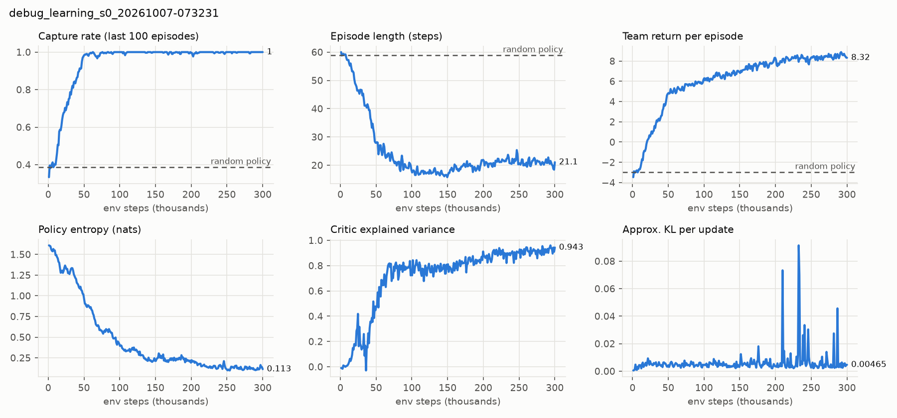

# M2 learning check: easy Pursuit variant

**Question:** does the full MAPPO pipeline (subprocess envs → recurrent actor →
centralized critic → GAE → PPO) learn on the real simulator?

**Setup** (`configs/debug_learning.yaml`): 10×10 grid, 2 pursuers with 5×5 views,
3 frozen evaders, capture by stepping onto an evader (`surround: false`, `n_catch: 1`),
60-step episodes. Trained 300k env steps (16 envs × 64 steps, 8 workers, seed 0) on an
RTX 3050 Laptop + i5-12500H: **2 min 4 s, ~2,400 env steps/s**. Code at `2259b17`.

**Held-out evaluation:** 100 episodes from the `eval` seed stream, identical episodes
for every row.

| Policy | Capture rate | All 3 caught | Episode length | Time to capture | Team return |
|---|---|---|---|---|---|
| Random | 0.387 | 5 % | 58.9 | 23.5 | −2.96 |
| MAPPO, sampled actions | **1.000** | **100 %** | 21.0 | 11.8 | 8.40 |
| MAPPO, greedy actions | **1.000** | **100 %** | 19.7 | 11.1 | 8.44 |

**Observations**

- Capture rate passes 0.98 by ~50k env steps; the critic's explained variance reaches 0.94.
- **Joint captures (reward property of Pursuit):** after ~150k steps the return keeps
  rising while episodes get *longer* (≈17 → 21 steps). PettingZoo credits `catch_reward` to
  every pursuer on the evader's cell, so with the shared reward two pursuers stepping on
  together earn 5.0 each instead of 2.5. The agents learn to wait for each other. Measured
  from the raw episodes: catch reward per capture, (return + 0.1·length) / captures,
  rises from 2.56 to 3.51 over training (2.5 = all solo, 5.0 = all joint). Waiting is not
  free: urgency is −0.1 per step against +0.01 per tag. Return therefore mixes speed and
  coordination; M7 reports capture rate and time-to-capture first.
  *(Corrected after the M2 review: an earlier version wrongly blamed the tag reward.)*
- Approximate KL shows occasional spikes (≤ 0.09) once entropy is low (< 0.3).
  `ppo.target_kl` is available if this becomes a problem on the full task.

This is a single-seed sanity check of the training pipeline, not a scientific result.
