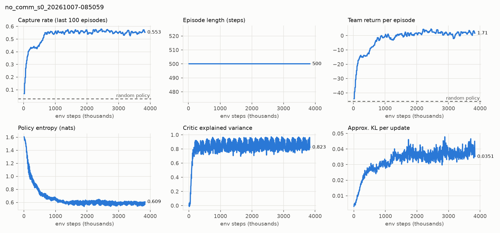

# M2 baseline, first attempt (local PC, interrupted)

**Status:** superseded by the SageMaker baseline run. Kept because the plateau is a real observation.

- Config `configs/no_comm.yaml` (16×16, 8 pursuers, 30 evaders, 500 steps, seed 0, deterministic GPU),
  code `d040366` (recorded as `a93d78e` before the history rewrite, same tree).
- RTX 3050 Laptop + i5-12500H, 32 envs / 12 workers: ~800 env steps/s, 1.85 s per PPO update,
  peak VRAM 1.25 GB, env workers 0.83 GB RAM in total.
- **Killed at update 937 / 1221 (3.84M of 5M env steps)** when the Claude Code session ended.
  `latest.pt` from update 920 survives locally (not committed).

Training-window statistics (last 100 training episodes; not a held-out evaluation):

| Env steps | Capture rate | Team return | Entropy | Approx. KL | Clip frac. | Expl. var. |
|---|---|---|---|---|---|---|
| random policy (eval) | 0.029 | −45.96 | – | – | – | – |
| 0.10M | 0.332 | −24.4 | 1.28 | 0.008 | 0.11 | 0.62 |
| 0.70M | 0.551 | −4.4 | 0.72 | 0.024 | 0.18 | 0.78 |
| 2.00M | 0.572 | 1.8 | 0.63 | 0.034 | 0.19 | 0.84 |
| 3.84M | 0.553 | 1.7 | 0.61 | 0.035 | 0.18 | 0.82 |

**Observations**

1. Capture rate rises in two steps (≈0.43 by 0.2M, ≈0.55 by 0.7M) and then stays flat at
   0.55–0.57 for 3M steps. No episode clears all 30 evaders within 500 steps. With 7×7 views and no
   messages the remaining scattered evaders are hard to find. This is the gap communication (M3+)
   is meant to close.
2. Return keeps rising slowly while capture rate is flat, consistent with more joint captures
   (see the reward property in [m2_learning_check.md](m2_learning_check.md)).
3. Approximate KL grows steadily (0.004 → 0.036) while performance is flat, so late updates are larger
   than needed. Candidate fix before M3: learning-rate decay or `ppo.target_kl`, applied identically
   to every method.
